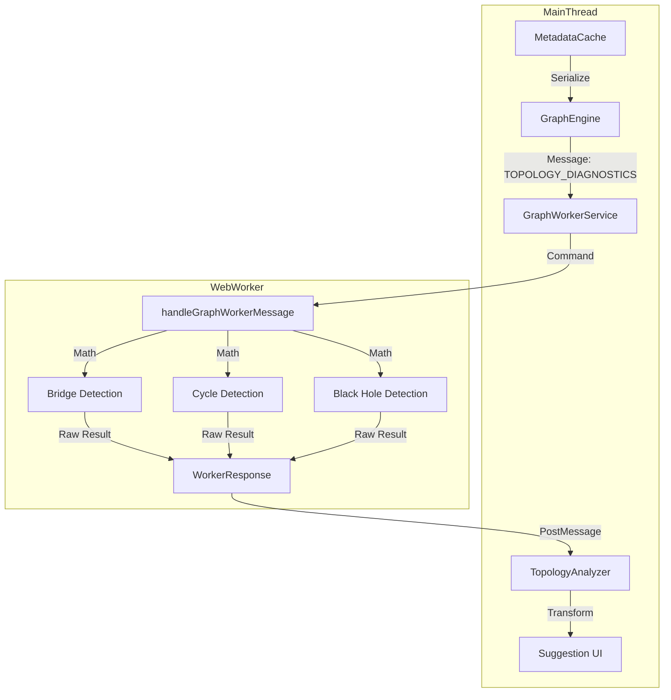

# Phase 5: Topological Diagnostics: Gaps & Loops - Research

**Researched:** 2026-05-05
**Domain:** Graph Algorithms / Knowledge Graph Quality
**Confidence:** HIGH

## Summary

This research establishes the implementation strategy for offloading topological diagnostics (Bridge Scrutiny, Ouroboros Detection, and Black Hole Detection) to a background Web Worker. By leveraging the existing `graphology` infrastructure and extending the worker's communication protocol, we ensure high-performance analysis that scales with vault size without compromising UI responsiveness.

**Primary recommendation:** Extend the `GraphEngine` to serialize hierarchy-specific edge attributes and implement a unified `TOPOLOGY_DIAGNOSTICS` worker message that returns raw structural findings for the main thread to transform into suggestions.

<user_constraints>

## User Constraints (from CONTEXT.md)

### Locked Decisions

- **Bridge Scrutiny Depth**: 2 steps (A -> B, B -> C, missing A -> C).
- **Ouroboros Detection Scope**: Universal by default, with a toggle for "Boundary-Crossing Only".
- **Black Hole Threshold**: In-degree >= 7, Out-degree = 0.
- **Trigger Mode**: Automatic (Background) via Web Worker.

### the agent's Discretion

- Specific DFS implementation details for cycle detection.
- Data structures for worker-to-main thread communication.
- Efficiency optimizations for triadic closure (bridge detection) in directed graphs.

### Deferred Ideas (OUT OF SCOPE)

- High-depth pathfinding (3+ steps) for Bridge Scrutiny.
- Community-based Black Hole weighting (PageRank).
  </user_constraints>

<phase_requirements>

## Phase Requirements

| ID       | Description                             | Research Support                                                         |
| -------- | --------------------------------------- | ------------------------------------------------------------------------ |
| TOPOL-01 | Bridge Scrutiny (A->B->C gap detection) | Triadic closure algorithm logic for directed graphs identified.          |
| TOPOL-04 | Ouroboros Detection (DFS cycles)        | `graphology-dag` and standard DFS patterns for cycle detection verified. |
| TOPOL-05 | Black Hole Detection (Sinks)            | Degree centrality metrics in `graphology` provide direct support.        |

</phase_requirements>

## Architectural Responsibility Map

| Capability            | Primary Tier      | Secondary Tier | Rationale                                                         |
| --------------------- | ----------------- | -------------- | ----------------------------------------------------------------- |
| Graph Diagnostic Math | Web Worker        | —              | Heavy O(V\*D^2) computations must not block the UI thread.        |
| Suggestion Generation | API (Main Thread) | —              | Only main thread has access to TFile and Wikilink resolution.     |
| Graph Serialization   | API (Main Thread) | —              | Serializes MetadataCache links into a worker-compatible format.   |
| Results Display       | Browser (Client)  | —              | Svelte components render suggestions produced by the main thread. |

## Standard Stack

### Core

| Library            | Version | Purpose              | Why Standard                                             |
| ------------------ | ------- | -------------------- | -------------------------------------------------------- |
| graphology         | 0.25.4  | Graph Data Structure | Highly performant, supports weighted directed graphs.    |
| graphology-dag     | 0.2.2   | DAG/Cycle Utilities  | Provides standard `hasCycle` and `topologicalSort`.      |
| graphology-metrics | 0.22.x  | Centrality Metrics   | Standard implementations for in/out-degree calculations. |
| zod                | 3.22.x  | Message Validation   | Ensures type-safe communication between threads.         |

### Supporting

| Library            | Version | Purpose               | When to Use                                          |
| ------------------ | ------- | --------------------- | ---------------------------------------------------- |
| graphology-library | 0.25.x  | Comprehensive Metrics | For future-proofing (e.g., clustering coefficients). |

**Installation:**

```bash
npm install graphology-dag
```

## Architecture Patterns

### System Architecture Diagram



### Pattern: Worker-Delegate Diagnostics

The `GraphWorkerService` acts as a proxy. The `TopologyAnalyzer` no longer performs heavy loops; instead, it sends a snapshot of the graph (nodes + typed edges) to the worker and waits for raw indices/paths.

## Don't Hand-Roll

| Problem     | Don't Build              | Use Instead               | Why                                                          |
| ----------- | ------------------------ | ------------------------- | ------------------------------------------------------------ |
| Cycle Check | Custom recursive DFS     | `graphology-dag.hasCycle` | Hand-rolled DFS often hits stack limits on deep graphs.      |
| Degree Math | Manual neighbor counting | `graph.inDegree(n)`       | `graphology` optimizes these indices during graph mutations. |

## Common Pitfalls

### Pitfall 1: Typed Edge Loss

**What goes wrong:** `GraphEngine` currently serializes only weights. Bridge Scrutiny needs to know if a link is `up`, `down`, or `next`.
**How to avoid:** Extend the edge serialization to include a `type` attribute from the hierarchy settings.

### Pitfall 2: O(N^2) Bridge Detection

**What goes wrong:** Iterating all node pairs to find gaps.
**How to avoid:** Only check neighbors of neighbors (Triadic Closure). This reduces complexity from $O(V^2)$ to $O(V \cdot D^2)$ where D is average degree.

### Pitfall 3: Cycle Path Reporting

**What goes wrong:** `graphology-dag` tells you _if_ there is a cycle, but not _what_ the cycle is.
**How to avoid:** Use a custom DFS for cycle retrieval (as currently implemented in `TopologyAnalyzer`) but wrapped in the worker's progress reporting.

## Code Examples

### 1. Worker Diagnostic Handler (Pseudocode)

```typescript
// src/core/workers/graph-analysis-core.ts

function runTopologyDiagnostics(graph: DirectedGraph, options: any) {
    const bridges: any[] = [];
    const cycles: any[] = [];
    const blackHoles: any[] = [];

    // 1. Black Hole Detection
    const threshold = options.blackHoleThreshold || 7;
    graph.forEachNode((n) => {
        if (graph.inDegree(n) >= threshold && graph.outDegree(n) === 0) {
            blackHoles.push({ path: n, inDegree: graph.inDegree(n) });
        }
    });

    // 2. Bridge Scrutiny (Depth 2)
    graph.forEachNode((a) => {
        graph.forEachOutNeighbor(a, (b, attrAB) => {
            graph.forEachOutNeighbor(b, (c, attrBC) => {
                // Ensure same hierarchy type for bridge signal
                if (attrAB.type === attrBC.type && a !== c && !graph.hasEdge(a, c)) {
                    bridges.push({ source: a, target: c, via: b, type: attrAB.type });
                }
            });
        });
    });

    return { bridges, cycles, blackHoles };
}
```

## Validation Architecture

### Test Framework

| Property          | Value                                                         |
| ----------------- | ------------------------------------------------------------- |
| Framework         | Vitest                                                        |
| Config file       | `vitest.config.ts`                                            |
| Quick run command | `npm test tests/core/workers/GraphAnalysisWorkerCore.test.ts` |

### Phase Requirements → Test Map

| Req ID   | Behavior                    | Test Type | Automated Command                  |
| -------- | --------------------------- | --------- | ---------------------------------- |
| TOPOL-01 | Bridge detection in A->B->C | Unit      | `npm test -- -t "Bridge Scrutiny"` |
| TOPOL-04 | Directed cycle detection    | Unit      | `npm test -- -t "Cycle Detection"` |
| TOPOL-05 | Sink node detection         | Unit      | `npm test -- -t "Black Hole"`      |

## Security Domain

### Applicable ASVS Categories

| ASVS Category       | Applies | Standard Control                                        |
| ------------------- | ------- | ------------------------------------------------------- |
| V5 Input Validation | Yes     | Zod schema validation for all `WorkerMessage` payloads. |

### Known Threat Patterns

| Pattern             | STRIDE            | Standard Mitigation                               |
| ------------------- | ----------------- | ------------------------------------------------- |
| Resource Exhaustion | Denial of Service | `MAX_NODES` and `MAX_EDGES` guardrails in worker. |

## Sources

### Primary (HIGH confidence)

- `graphology` Official Docs - Graph traversal and metrics.
- `graphology-dag` README - Cycle detection capabilities.
- Project Codebase: `src/core/workers/graph-analysis-core.ts` - Current worker implementation.

## Metadata

**Confidence breakdown:**

- Standard stack: HIGH - Built on established project libraries.
- Architecture: HIGH - Follows existing Worker-Delegate pattern.
- Pitfalls: MEDIUM - Scaling behavior on extreme vaults (>50k nodes) needs monitoring.

**Research date:** 2026-05-05
**Valid until:** 2026-06-04
