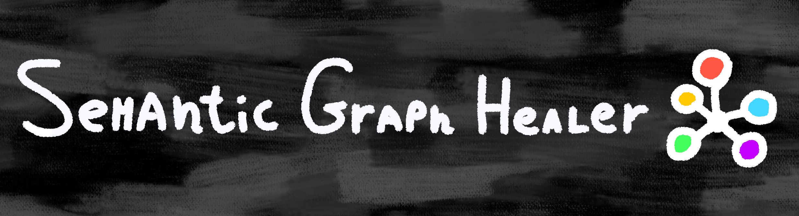

<!-- generated-by: gsd-doc-writer -->



# Semantic Graph Healer

Topological restoration engine that utilizes Dataview, Breadcrumbs, and ExcaliBrain metadata to identify and resolve structural inconsistencies in the knowledge graph.

[](https://github.com/lostpeanut09/semantic-graph-healer)
[](https://www.gnu.org/licenses/gpl-3.0)
[](https://github.com/lostpeanut09/semantic-graph-healer/actions/workflows/quality.yml)

**Semantic Graph Healer** is a topological restoration and deep graph analysis engine for Obsidian. It leverages [Datacore](https://github.com/blacksmithgu/datacore), [LadybugDB](https://github.com/ladybugdb/ladybugdb), [Breadcrumbs](https://github.com/Sirenko/obsidian-breadcrumbs), [ExcaliBrain](https://github.com/zsviczian/excalibrain), and [Graphology](https://graphology.github.io/) to identify and resolve structural inconsistencies in the knowledge graph. It's designed for researchers and curators managing large-scale digital gardens where manual link auditing is no longer feasible.

> This plugin is still being developed and its not avaibale for the official obsidian plugins marketplace yet. Its still fully experiment, however released thats start with the name endpoint are prolly experimental and mostly unstable, used only for testing.

## Installation

### For Users (Obsidian BRAT)

To install the pre-release version using [BRAT](https://github.com/TfTHacker/obsidian42-brat):

1. Install the BRAT plugin from the Community Plugins list.
2. Go to BRAT settings and add the beta plugin repository: `lostpeanut09/semantic-graph-healer`.
3. Enable the plugin in your Obsidian settings.

### For Developers

To build the plugin from source:

```bash
git clone https://github.com/lostpeanut09/semantic-graph-healer.git
cd semantic-graph-healer
npm install
npm run build
```

## Quick Start

1. Ensure required dependencies like **Datacore** are installed and enabled in your Obsidian vault.
2. Enable **Semantic Graph Healer** in Obsidian settings.
3. Open the Command Palette (`Ctrl/Cmd + P`) and search for **Semantic Graph Healer**.
4. Open the **Dashboard** to view structural gaps, orphans, and semantic conflicts, then click **Execute** on any suggestion to repair the topology.

## Usage Examples

1. **Repairing Structural Gaps**: The engine detects a chain `A -> C` where a note `B` logically fits between them (`A -> B -> C`). Use the **Triple Relink Executor** in the dashboard to repair the entire chain in one action, automatically updating the frontmatter for all three notes.
2. **Finding Information Sinks (Black Holes)**: Switch the dashboard filter to **Black Holes** to find notes with high in-degree but zero out-degree. Powered by **LadybugDB**, this analysis runs instantly even on vaults with 10k+ nodes.
3. **AI Reasoning and Tribunal**: Use the **ReasoningService** to verify complex incongruences. If multiple conflicting values exist for a property, click **Check results / Re-reason** to invoke a dual-LLM setup (**AI Tribunal**) that analyzes note content and semantic vectors to identify the most logically sound connection.

## Technical Features

### Robust Vault Query Engine

The plugin implements a production-grade **Query Engine** powered by Datacore:

1. **Datacore** (Primary Engine) — Up to 100x faster than Dataview, with reactive queries and a modern schema (`$path`, `$tags`, `$links`). Datacore is strictly required.
2. **MetadataCache** (Baseline) — Native Obsidian cache utilized for specific low-level backlink resolutions and normalized keys.

A robust adapter layer transparently utilizes Datacore to ensure high semantic parity and speed.

### High-Performance Graph Database (LadybugDB)

The plugin features a built-in **LadybugDB** instance — a high-performance graph database powered by WASM:

- **Cypher Query Language** — Enables complex topological pattern matching (e.g., bridge detection, cycle analysis) using industry-standard graph query syntax.
- **WASM Acceleration** — Offloads heavy graph traversals and pattern matching to a compiled WebAssembly core.
- **Web Worker Offloading** — On desktop, all database operations and graph algorithms run in a dedicated background thread, ensuring zero impact on UI responsiveness.
- **Automatic Sync** — Synchronizes vault nodes and links from the `UnifiedMetadataAdapter` into the graph database in real-time.

### Multi-Adapter Architecture

The plugin implements a modular adapter pattern (`IMetadataAdapter`) for seamless integration with the broader Obsidian ecosystem:

- **`DatacoreAdapter`** — High-performance reactive queries via the Datacore API.
- **`LadybugAdapter`** — Bridge to the LadybugDB engine for advanced topological queries.
- **`BreadcrumbsAdapter`** — Seamlessly navigates hierarchical relationships (up/down/next/prev).
- **`SmartConnectionsAdapter`** — Orchestrates the modern Smart Environment API to fetch AI vector-similarity scores.
- **`UnifiedMetadataAdapter`** — Orchestrates all adapters into a single, cohesive, and failure-resilient API surface.

### Deep Graph Analysis

When enabled, the engine runs academic-grade algorithms powered by **Graphology** and **LadybugDB**:

- **PageRank** — Identifies authority notes (top 5% by score).
- **Louvain Community Detection** — Discovers thematic clusters of tightly connected notes and suggests MOC creation for clusters with 5+ members.
- **Betweenness Centrality** — Finds critical bridge notes connecting disparate topics.
- **Cycle Detection (Ouroboros)** — DFS-based and Cypher-powered detection of infinite loops in the hierarchy graph.

### AI-Driven Deep Reasoning (ReasoningService)

The `ReasoningService` provides the intelligence layer for resolving topological conflicts:

- **Content-Aware Analysis** — Reads note content to determine the conceptual validity of a proposed link.
- **Semantic Vector Integration** — Incorporates similarity scores from **Smart Connections** to weight candidates.
- **AI Tribunal** — Implements a dual-LLM verification system. Every suggestion is processed by a Primary and a Secondary model to ensure consensus and prevent hallucinations.
- **HTR (Healer Topology Rank) Scoring** — A proprietary formula that blends semantic similarity, folder depth, and graph centrality to rank resolution candidates.

### Deterministic Link Prediction Engine

The `LinkPredictionEngine` implements a scientifically-grounded three-way blend of link prediction indices to discover **"Missing Rings"**:

| Algorithm               | Weight | Reference                      |
| :---------------------- | :----- | :----------------------------- |
| **Jaccard Similarity**  | 0.35   | Liben-Nowell & Kleinberg, 2004 |
| **Adamic-Adar Index**   | 0.35   | Adamic & Adar, 2003            |
| **Resource Allocation** | 0.30   | Lü & Zhou, 2010                |

### StructuralCache — Performance Layer

A generic LRU (Least Recently Used) caching layer sits between the query engine and the analysis modules:

- **Event-based invalidation** — Automatically purges cache entries when files are modified or deleted.
- **Memory budget** — Hard cap of 10,000 entries with LRU eviction to prevent memory bloat on mobile devices.
- **Explicit lifecycle management** — Comprehensive `destroy()` pattern to prevent memory leaks.

### Secure Credential Management

API credentials for all providers are managed via the **KeychainService** with defense-in-depth encryption:

1. **Obsidian SecretStorage** (v1.11.4+) — Primary backend using the OS-native credential store.
2. **AES-256-GCM Software Encryption** — Fallback encryption at rest using a derived master key.
3. **Keychain Safety** — Secrets are **never stored in plain text** within `data.json`.

---

## Experimental AI

- **Semantic Tag Propagation:** AI-driven analysis to push relevant tags from MOCs down to child notes.
- **AI Branch Validation:** Resolves topological errors in parallel paths (multiple `next`/`prev` links).
- **Cross-Thematic Inference:** Suggests links between disparate clusters identified by Louvain communities.

---

## Dashboard

The dashboard features a **partial re-rendering architecture** for a flicker-free experience.

### Filters

| Filter                  | Description                        |
| ----------------------- | ---------------------------------- |
| All Issues              | Full unfiltered view               |
| Orphan Notes            | Notes with zero hierarchical links |
| Semantic Conflicts      | Multi-value incongruences          |
| Missing Reciprocals     | Asymmetric directional links       |
| Structural Gaps         | Bridge chain insertions            |
| Logic Loops (Ouroboros) | Hierarchical cycle errors          |
| Black Holes (Sinks)     | High in-degree, zero out-degree    |
| AI Suggestions          | LLM-generated proximity links      |

---

## Requirements

- Obsidian v1.5.0 or higher.
- [Datacore](https://github.com/blacksmithgu/datacore) plugin (required for query engine).
- [LadybugDB WASM](https://github.com/ladybugdb/wasm-core) (bundled, requires Desktop for full performance).
- [Ollama](https://ollama.com) or a valid Cloud LLM API key (for AI features).

## Contributing

See [CONTRIBUTING.md](CONTRIBUTING.md) for guidelines.

## License

This project is licensed under the [GPL-3.0 License](LICENSE).
