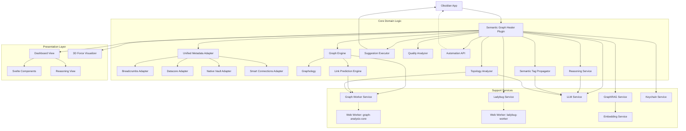

<!-- generated-by: gsd-doc-writer -->

# ARCHITECTURE.md

## System Overview

Semantic Graph Healer is an Obsidian plugin designed for topological restoration and multi-layered semantic optimization of the knowledge graph. It automatically identifies structural inconsistencies (orphans, dangling links, black holes) and provides context-aware "healing" suggestions to improve vault connectivity. The system aggregates metadata via a `UnifiedMetadataAdapter` interfacing with plugins like **Datacore**, **Breadcrumbs**, and **Smart Connections**, while synchronizing hierarchy definitions from **ExcaliBrain**. 

The architecture is built on a dual-engine strategy: a primary in-memory `Graphology` graph for real-time analysis and a WASM-based `@ladybugdb` engine offloaded to Web Workers for heavy computations. Beyond traditional graph theory (PageRank, Louvain communities), the system incorporates an AI-driven `GraphRAG` layer, an autonomous `ReasoningService` for explaining structural gaps, and a `SemanticTagPropagator` for hierarchical taxonomy inference.

## Component Diagram

## Data Flow

1.  **Ingestion & Normalization**: The `UnifiedMetadataAdapter` orchestrates specialized adapters to fetch metadata from the Obsidian vault and active plugins. It normalizes disparate link types (Breadcrumbs hierarchies, Datacore properties) into a unified internal format.
2.  **Graph Construction & Prediction**: The `GraphEngine` translates normalized metadata into an in-memory `Graphology` instance. The `LinkPredictionEngine` utilizes Jaccard and Adamic-Adar indices (offloaded to Web Workers) to identify missing but topologically likely connections.
3.  **Background Analysis**: The `TopologyAnalyzer` inspects the graph to detect structural anomalies (e.g., black holes, missing bridges). Heavy computations (PageRank, Louvain communities) are handled by the `GraphWorkerService` or synced to a WASM `LadybugDB` instance via `LadybugService`.
4.  **Semantic Enrichment & Propagation**:
    - The `SemanticTagPropagator` identifies tag inheritance gaps within clusters.
    - The `LlmService` and `GraphRagService` process semantic proximity and derive community summaries stored in AJSON format.
5.  **AI Reasoning**: For complex structural incongruences, the `ReasoningService` dispatches context-aware prompts to the LLM to explain the relationship between nodes and validate candidate repairs.
6.  **Suggestion Generation & Deduplication**: Analysis results are converted into actionable `Suggestion` objects. The `CacheService` ensures stability and prevents duplicate suggestions across analysis runs.
7.  **Interaction & Execution**: Users review findings via the `DashboardView` or the `GraphVisualizerView`. The `SuggestionExecutor` applies changes directly to the vault files using the Obsidian API, triggering real-time graph updates.

## Key Abstractions

- `IMetadataAdapter` (`src/core/adapters/IMetadataAdapter.ts`): Interface defining how to extract links and metadata from various vault sources.
- `GraphEngine` (`src/core/GraphEngine.ts`): Central authority for maintaining the in-memory graph structure and caching topological metrics.
- `ReasoningService` (`src/core/ReasoningService.ts`): AI-powered agent that analyzes competing structural values to identify optimal repairs.
- `LlmService` (`src/core/LlmService.ts`): Unified interface for interacting with various LLM providers (OpenAI, Anthropic, Local) with built-in retry logic and structured output parsing.
- `TopologyAnalyzer` (`src/core/TopologyAnalyzer.ts`): The primary orchestrator for structural audits, managing multiple specialized analysis routines (deterministic, cycle, sink, semantic).
- `GraphRagService` (`src/core/services/GraphRagService.ts`): Builds community-centric summaries and processes semantic context queries using vector similarity.
- `SuggestionExecutor` (`src/core/SuggestionExecutor.ts`): Encapsulates the logic for performing safe file system operations (create, append, modify properties) and manages execution history.

## Directory Structure Rationale

- `src/core`: Contains the domain logic of the plugin. Subdivided into `adapters` (input), `services` (cross-cutting concerns), `utils` (shared helpers), and `workers` (heavy computation).
- `src/core/adapters`: Implements the Adapter pattern to decouple the plugin from the specific APIs of 3rd-party dependencies like Breadcrumbs, Datacore, and LadybugDB.
- `src/core/services`: Infrastructural domains such as `LlmService`, `GraphRagService`, `KeychainService`, and `AutomationApi`.
- `src/core/workers`: Contains Web Worker source code (`graph-analysis-core.ts`, `ladybug-worker.ts`), compiled separately to ensure heavy algorithms don't block the UI thread.
- `src/views`: Contains the presentation layer. Uses Svelte 5 for reactive state management (`DashboardView`) and `3d-force-graph` for interactive visualizations (`GraphVisualizerView`).
- `src/types.ts` & `src/types.schema.ts`: Centralized type definitions and Zod schemas for runtime validation and configuration management.
