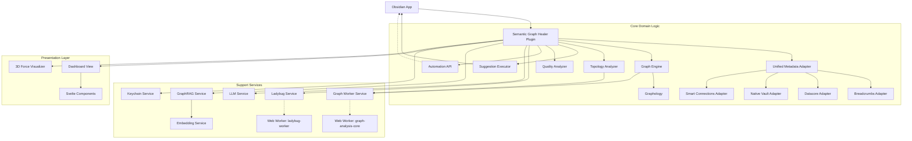

<!-- generated-by: gsd-doc-writer -->

# ARCHITECTURE.md

## System Overview

Semantic Graph Healer is an Obsidian plugin designed for topological restoration and semantic optimization of the knowledge graph. It automatically identifies structural inconsistencies (orphans, dangling links, black holes) and provides context-aware "healing" suggestions to improve vault connectivity. The system aggregates metadata via a `UnifiedMetadataAdapter` interfacing with plugins like Datacore, Breadcrumbs, and Smart Connections. For performance, it utilizes a dual-engine architecture: a primary in-memory `Graphology` graph and a WASM-based `@ladybugdb` engine offloaded to Web Workers. It pairs traditional graph theory (PageRank, Louvain communities) with an LLM-driven `GraphRAG` layer to ensure the vault remains a coherent, navigable, and semantically rich knowledge base.

## Component Diagram

## Data Flow

1.  **Ingestion & Normalization**: The `UnifiedMetadataAdapter` orchestrates specialized adapters to fetch metadata from the Obsidian vault and active plugins (Datacore, Breadcrumbs, Smart Connections).
2.  **Graph Construction**: The `GraphEngine` translates normalized metadata into an in-memory `Graphology` instance representing the vault's topology. Advanced workflows use `LadybugAdapter` to sync the graph into a WASM-based LadybugDB instance.
3.  **Background Analysis**: The `TopologyAnalyzer` inspects the graph to detect structural anomalies (e.g., black holes, missing bridges). Heavy computations (PageRank, Louvain community detection) are offloaded asynchronously via `GraphWorkerService` and `LadybugService`.
4.  **Semantic Enrichment**: The `LlmService`, `EmbeddingService`, and `GraphRagService` supplement topological findings with semantic proximity, deriving community summaries (stored in AJSON format) and answering RAG-based context queries.
5.  **Suggestion Generation**: The system evaluates analysis results to produce actionable `Suggestion` objects (e.g., "Create missing note", "Add backlink", "Merge duplicate tags"), deduplicating and storing them via the `CacheService`.
6.  **User Interaction**: Users review suggestions via the Svelte-powered `DashboardView` or the `GraphVisualizerView`. For automated workflows, operations can be triggered headlessly through the `AutomationApi`.
7.  **Automated Healing**: Upon user or CLI approval, the `SuggestionExecutor` safely applies the changes directly to vault files using the Obsidian API, emitting events that trigger real-time graph updates.

## Key Abstractions

- `IMetadataAdapter` (`src/core/adapters/IMetadataAdapter.ts`): Interface defining how to extract links and metadata from various vault sources.
- `UnifiedMetadataAdapter` (`src/core/adapters/UnifiedMetadataAdapter.ts`): A Facade that aggregates results from all active metadata adapters.
- `GraphEngine` (`src/core/GraphEngine.ts`): Central authority for maintaining the in-memory graph structure and caching topological metrics.
- `GraphRagService` (`src/core/services/GraphRagService.ts`): Builds community-centric summaries and processes semantic context queries using vector similarity.
- `AutomationApi` (`src/core/services/AutomationApi.ts`): Provides a programmatic interface for CLI or URI-based headless batch operations.
- `SuggestionExecutor` (`src/core/SuggestionExecutor.ts`): Encapsulates the logic for performing safe file system operations (create, append, modify properties) and manages execution contexts.
- `KeychainService` (`src/core/services/KeychainService.ts`): Manages secure API key storage using Obsidian's native `SecretStorage` (v1.11.4+).

## Directory Structure Rationale

- `src/core`: Contains the "brain" of the plugin. Subdivided into `adapters` (input), `services` (cross-cutting concerns), and `workers` (heavy computation).
- `src/core/adapters`: Implements the Adapter pattern to decouple the plugin from the specific APIs of 3rd-party dependencies like Breadcrumbs, Datacore, and LadybugDB.
- `src/core/services`: Core infrastructural domains and external API integrations, such as `LlmService`, `GraphRagService`, and `KeychainService`.
- `src/core/ports`: Defines the interfaces for external plugin interactions, following hexagonal architecture principles.
- `src/core/workers`: Contains Web Worker source code (`graph-analysis-core.ts`, `ladybug-worker.ts`), compiled separately to ensure heavy algorithms don't block the main UI thread.
- `src/views`: Contains the presentation layer. Uses Svelte 5 for reactive state management (`DashboardView`) and `3d-force-graph` for interactive visualizations (`GraphVisualizerView`).
- `src/types.ts` & `src/types.schema.ts`: Centralized type definitions and Zod schemas for runtime validation and configuration management.
